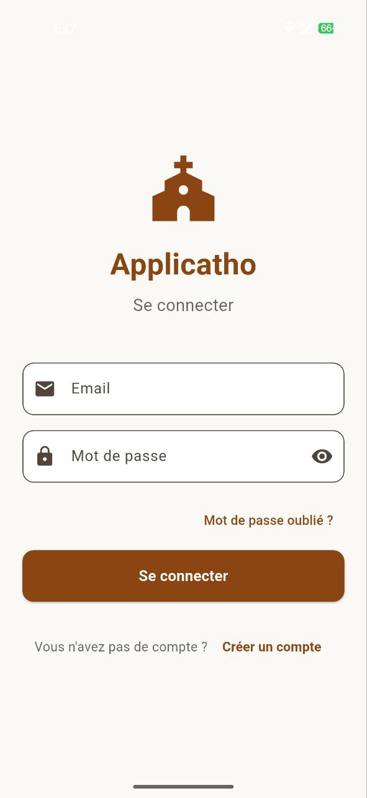
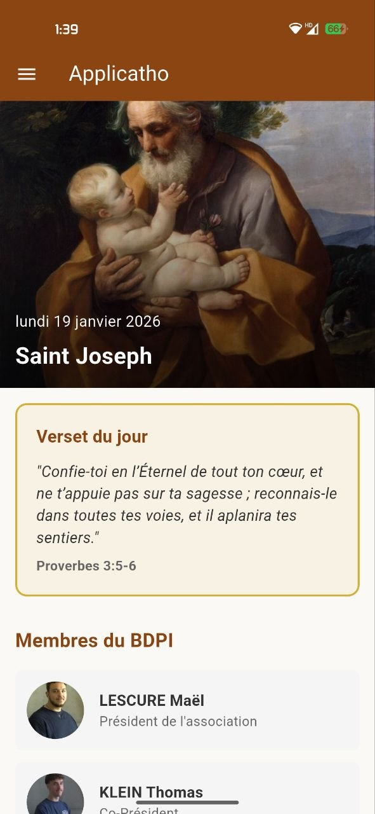
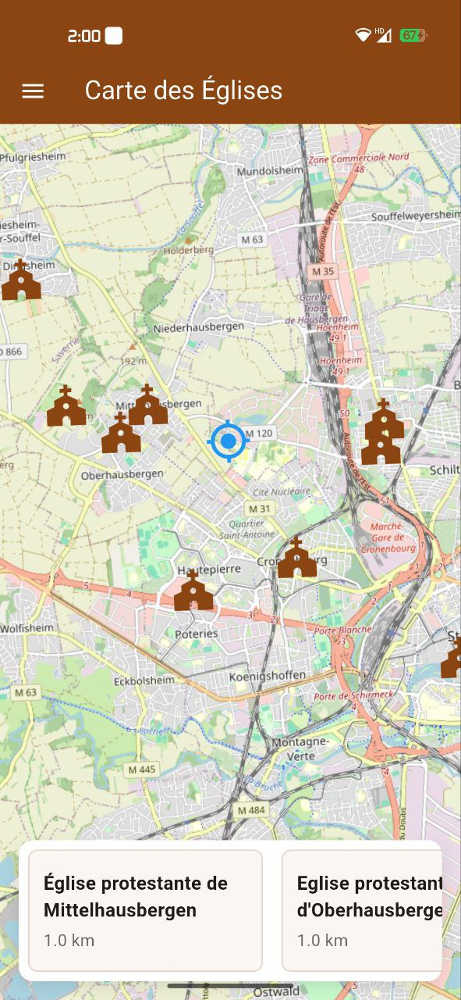
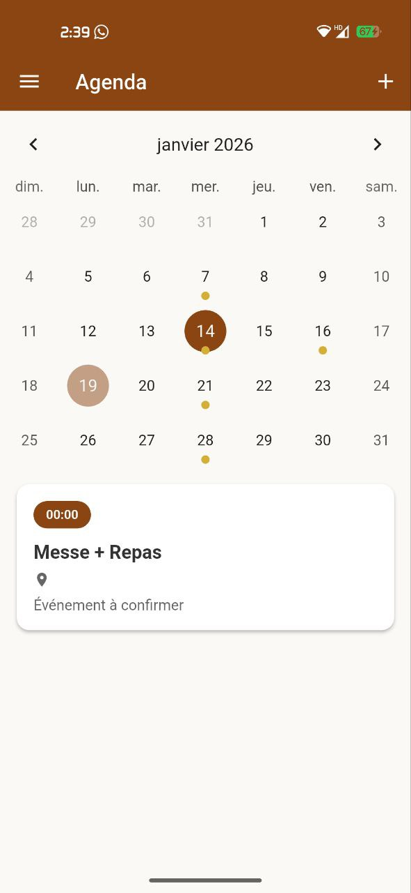
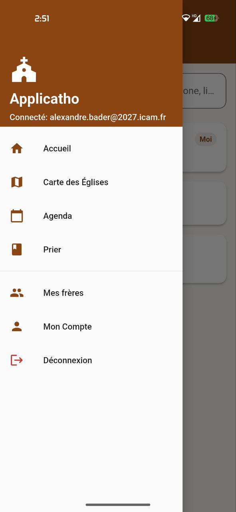

# Applicatho

A mobile application developed as part of my engineering studies for the Catholic association of our school (ICAM). This Flutter-based app provides a comprehensive platform for the Catholic community to access daily spiritual content, events, prayers, and church locations.

## Presentation

**Applicatho** is a mobile application created during my engineering studies at ICAM. The project was developed for the Catholic association (BDPI) of our school to help students and community members stay connected with their faith through easy access to daily spiritual content, event calendars, prayers, and nearby church locations.

The application serves as an information hub that brings together various resources in one convenient mobile platform, making it easier for the Catholic community to engage with their faith on a daily basis.

## Features

The application offers several key features accessible through an intuitive interface:

### Authentication & Navigation

- Secure user authentication system
- Clean and user-friendly login interface

### Home Screen

- **Saint of the Day**: Daily saint information with image and description
- **Verse of the Day**: Inspirational Bible verses
- **BDPI Members**: Presentation of association members with profile photos
- **Upcoming Events**: Display of the next 3 events
- **FAQ Section**: Expandable questions and answers
- **Social Media Links**: Quick access to WhatsApp, Instagram, and YouTube

### Interactive Church Map

- Interactive map using OpenStreetMap
- Real-time geolocation
- Nearby church locations with detailed information
- Distance calculation and contact details

### Event Calendar

- Monthly calendar view
- Event listings with dates and times
- Detailed event information (location, description, images)

### Prayer & Verses
- Categorized prayer library
- Bible verse collection
- Easy navigation and search functionality

### Navigation Menu

- Intuitive drawer navigation
- Quick access to all features
- User profile management

## Tech Stack

- **Frontend Framework**: Flutter (Dart)
- **Backend & Database**: Firebase (Firestore, Authentication, Storage)
- **State Management**: Provider
- **Maps**: OpenStreetMap via flutter_map
- **Calendar**: table_calendar
- **Additional Libraries**: 
  - Geolocator for location services
  - Cached Network Image for optimized image loading
  - URL Launcher for external links

## Project Structure

```
lib/
├── main.dart                    # Application entry point
├── models/                      # Data models
│   ├── saint.dart
│   ├── verse.dart
│   ├── event.dart
│   ├── prayer.dart
│   ├── church.dart
│   ├── member.dart
│   └── faq.dart
├── providers/                   # State management
│   └── auth_provider.dart
├── screens/                     # Application screens
│   ├── auth_screen.dart
│   ├── home_screen.dart
│   ├── church_map_screen.dart
│   ├── agenda_screen.dart
│   ├── prayer_screen.dart
│   └── admin_screen.dart
├── services/                    # Business logic services
│   ├── auth_service.dart
│   └── firebase_service.dart
├── widgets/                     # Reusable UI components
│   ├── app_drawer.dart
│   ├── social_footer.dart
│   └── protected_route.dart
└── utils/                       # Utilities and constants
    └── constants.dart
```

## Future Development

- [ ] Complete admin panel implementation for content management
- [ ] Push notifications for upcoming events
- [ ] Audio player integration for prayers
- [ ] Offline mode with data caching
- [ ] Favorites system for prayers and verses
- [ ] Social sharing functionality for verses
- [ ] Multi-language support
- [ ] Dark mode theme
- [ ] User preferences and customization options

## License

This project is licensed under the MIT License - see the LICENSE file for details.

## Contact

For questions, suggestions, or collaboration opportunities, please contact:

**Alexandre Bader**  
Email: alexandre.bader@2027.icam.fr
